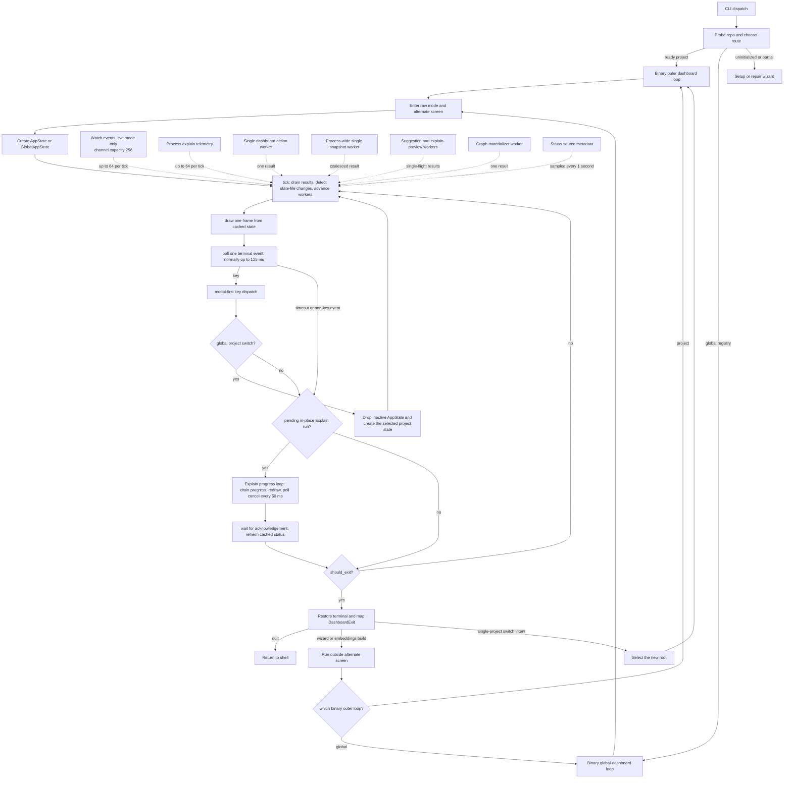

# TUI and CLI Control Loops

This document describes the current dashboard control flow, including the
parts that can still block or outlive a dashboard state. It is a map of the
implemented system, not a target architecture.

Read this before changing dashboard input handling, background work, project
switching, watch/explain coordination, terminal restoration, or process memory
ownership.

## Entry points and ownership

The binary owns the outer orchestration loop. The TUI library owns one
alternate-screen session at a time.

- Bare `synrepo` probes the current location in
  `src/bin/cli_support/entry.rs`. A ready project enters the project dashboard;
  an uninitialized or partial project enters setup or repair. Outside a Git
  tree, a non-empty project registry enters the global dashboard.
- `synrepo dashboard` takes the same ready-project route but rejects setup and
  repair states instead of opening a wizard.
- `src/bin/cli_support/repair_cmd.rs::run_dashboard_with_sub_wizards` is the
  project dashboard's outer loop. It reopens the dashboard after an integration,
  explain setup, embeddings setup, or embeddings build handoff.
- `src/bin/cli_support/entry.rs::run_global_dashboard_with_sub_wizards` is the
  equivalent outer loop for the registry-backed global dashboard.
- `src/tui/dashboard.rs` owns raw mode, the alternate screen, rendering, and
  terminal restoration. `TuiSession::Drop` restores the terminal on early
  returns and panics.
- `src/tui/live_dashboard.rs` is a separate host used by foreground
  `synrepo watch`. It owns an in-process `WatcherSupervisor` and passes the
  service's event receiver into the same project dashboard loop.

The normal single-project poll dashboard starts or confirms a detached watch
daemon before it enters the alternate screen. The foreground watch dashboard
instead starts an in-process foreground service and stops it after the
dashboard session exits.

## Current control flow

The exact steady-state order in `src/tui/dashboard.rs` is:

1. Call `AppState::tick()` or `GlobalAppState::tick()`.
2. Draw a frame.
3. Poll and dispatch at most one terminal key event.
4. Run one queued Explain operation in its dedicated progress loop.
5. Repeat unless the state requested exit.

`tick()` does not rebuild a full status snapshot on a timer. It drains ready
results, performs a metadata-only status-source check once per second, and
requests a cached or full refresh only when those sources changed.

## Input precedence

Project-state key handling in `src/tui/app/key_handlers.rs` is ordered. Preserve
the order when adding a modal or global binding:

1. Stop-watch confirmation.
2. Enable-Explain confirmation.
3. Quick-action confirmation.
4. Commentary-generation input.
5. Explain folder picker.
6. Escape, quit, and tab switching.
7. Active-tab bindings.
8. Dashboard-wide actions.

Most modals deliberately allow quit and tab keys to fall through, clearing the
modal first. The global dashboard adds its own precedence before forwarding a
key to the active `AppState`: help, command palette, picker rename, project
picker, global Repos handling, then project-state handling.

## Background work and coalescing

The dashboard has several independent single-flight lanes. They are not one
global TUI worker because most are read-only and serve different panels.

| Lane | Work | Admission and completion |
|------|------|--------------------------|
| Dashboard action | Reconcile, sync, compatibility, watch start/stop, docs export/clean, telemetry config | One worker per `AppState`; a second action is rejected. `tick()` applies its result and requests a status refresh. |
| Status snapshot | Status, graph counts, readiness, integration state | One worker for the entire process through `SNAPSHOT_WORKER_ACTIVE`. Requests coalesce, with `Full` taking priority over `Cached`. |
| Suggestions | Repository-wide refactor suggestions | One worker per state. A changed mode or invalidation marks one reload instead of overlapping readers. |
| Explain preview | Whole-repo and changed-file preview | One worker per state. Refreshes coalesce into one follow-up load. |
| Materializer | Initial or manual graph bootstrap | One worker per state, reaped by `tick()`. It still uses the normal writer admission path. |
| Explain execution | Commentary mutation plus progress | A scoped worker with a dedicated 50 ms UI loop. Cancellation is cooperative at existing safe boundaries. |
| Foreground watch | Watch service and its global mutation worker | Owned by `WatcherSupervisor` in live mode. The watch service serializes reconcile, sync, and embedding mutations itself. |

All render widgets consume cached state. Expensive graph counts, suggestions,
and Explain previews must not move back into `draw_dashboard`.

## Explain and watch handoff

Explain requires direct writer admission. When the dashboard sees an active
watch service, `src/tui/app/confirm_stop_watch.rs` opens a confirmation modal.
Accepting it starts watch stop on the dashboard action worker. The frame loop
continues while shutdown waits for watch-owned mutation work to reach a safe
boundary.

On a successful stop, `finish_background_action` queues the original Explain
request. The next frame enters `src/tui/explain_run.rs`, which:

1. Loads the Explain context and acquires writer admission.
2. Runs commentary mutation on a scoped worker.
3. Drains progress and watch/explain telemetry, redraws, and polls cancellation
   every 50 ms.
4. Joins the worker after completion or cooperative cancellation.
5. Invalidates Explain preview state and requests a status refresh.

The normal dashboard `tick()` is paused during this secondary loop. Snapshot,
suggestion, preview, background-action, and materializer results wait until the
Explain loop returns. Their channels are bounded or single-result, so this
delays application without producing an unbounded queue.

Foreground watch shutdown is bounded at the TUI supervisor layer. If its
service thread does not finish within two seconds, the supervisor drops the
join handle. The thread is detached from the TUI, but the watch service keeps
its lease until any active watch mutation really finishes. The lease must not
claim that watch stopped while a detached writer still owns admission.

## Exit, project switching, and memory ownership

`EventLog` retains at most 128 entries. The live watch event channel retains at
most 256 events, and each watch or Explain telemetry source drains at most 64
events per frame so a producer cannot starve keyboard polling.

The global dashboard retains at most one project `AppState`. Switching projects
clears queued Explain/modal state, drops the inactive state and its receivers,
then creates the next state. This prevents every visited project's snapshots,
panel caches, and receivers from accumulating for the whole session.

Dropping a receiver does not cancel its producer:

- Snapshot, suggestion, Explain-preview, and dashboard-action threads finish
  their current operation and discard the result if the state disappeared.
- A dropped snapshot state can temporarily hold the process-wide snapshot
  permit. The next project's coalesced request retries after that worker exits.
- `MaterializerSupervisor::Drop` intentionally detaches an active bootstrap.
  The bootstrap may continue holding writer admission after a project switch
  or dashboard exit.
- Dashboard action workers have no join handle or cancellation token. Dropping
  an `AppState` detaches an in-flight action even though its result is discarded.

Those are lifecycle constraints, not permission to add more detached mutable
work. New mutation workers need explicit ownership, cancellation behavior, and
a truthful lease or lock signal.

## Current audit findings

The main frame loop is responsive during snapshot rebuilds, reconcile, sync,
watch shutdown, preview loads, suggestion scans, materialization, and provider
calls. The following current paths still run synchronously on the UI thread and
can pause drawing or input:

- `AppState::new` builds a baseline status snapshot and integration rows after
  entering the alternate screen. Exact graph counts are deferred, but a slow
  baseline probe can still delay the first frame.
- `GlobalAppState::new` calls `load_project_refs()` after entering the alternate
  screen. It probes every registered project before the first global frame.
- Entering the single-project Repos tab lazily calls the same full registry
  scan from key dispatch.
- Watch toggles in `src/tui/app/explore.rs` and
  `src/tui/projects/watch.rs` call daemon start/stop directly instead of using
  the dashboard action worker.
- The global picker's `a` binding runs `bootstrap()` directly inside key
  dispatch before registering the current directory.
- `src/tui/embedding_build_run.rs` is not declared by `src/tui/mod.rs` and is
  not part of the compiled dashboard. The active `B` path exits the alternate
  screen and calls `embeddings_build_human` from
  `src/bin/cli_support/repair_cmd.rs`; do not infer runtime behavior from the
  orphaned in-dashboard implementation.
- Explain's progress loop remains responsive, but it cannot return to the main
  dashboard until the scoped worker exits. Cancellation cannot interrupt a
  blocking provider call or structural transaction mid-operation.

Treat these as follow-up candidates when a report mentions a frozen first
frame, a slow Repos tab, an unresponsive project watch toggle, slow project add,
or memory/writer ownership surviving a project switch.

## Change checklist

When changing this area:

- Keep render functions cache-only.
- Keep keyboard polling bounded. Bound every event drain independently.
- Define whether a new worker is per-state, process-wide, or process-owned.
- Define what happens when its receiver is dropped or its project is switched.
- Do not expose a stopped watch lease while watch-owned writer work is alive.
- Do not retain inactive `AppState` values in the global dashboard.
- Restore the terminal before running a wizard or normal-terminal command.
- Add focused tests for modal precedence, dropped receivers, project switching,
  and failure restoration.

Useful focused tests live in:

- `src/tui/app/tests/`
- `src/tui/projects/tests.rs` and `src/tui/projects/picker_tests.rs`
- `src/tui/watcher/tests.rs`
- `src/bin/cli_support/tests/dashboard_parity.rs`
- `src/tui/tests.rs`
